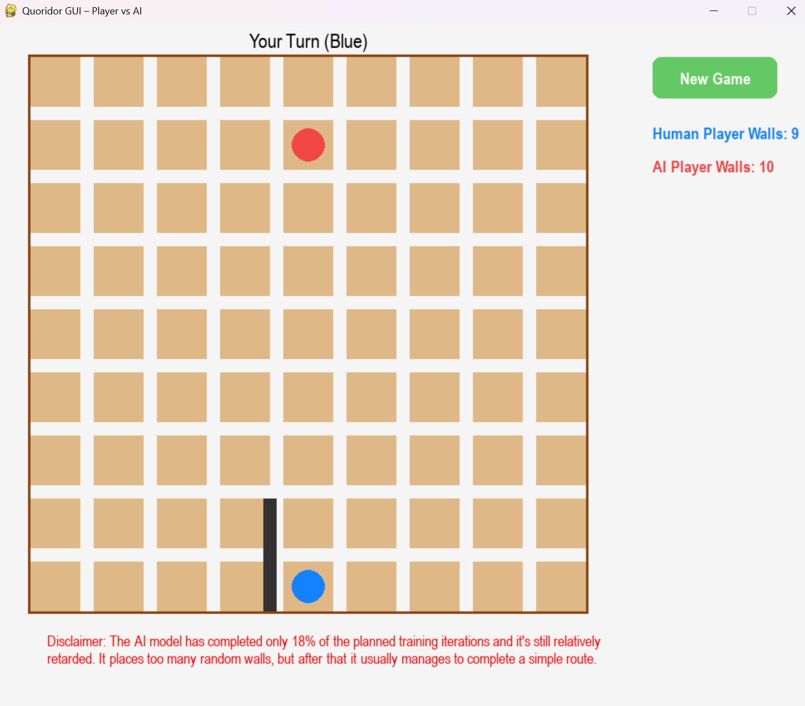

# Quoridor AI (AlphaZero Implementation)
This project provides a framework for training an AI agent to play Quoridor, a strategic board game where players race 
to move their pawn to the opposite side of a 9x9 board. Players can also place walls to obstruct their opponent's path.
The implementation is based on principles introduced by AlphaGo Zero and AlphaZero, and it includes a complete 
training pipeline as well as a Pygame-based GUI for playing against the trained agent.

### How it works
The agent learns to play Quoridor purely through self-play reinforcement learning without any domain knowledge. It uses
Monte Carlo Tree Search (MCTS) with PUCT algorithm ensuring good balance between exploitation and exploration.
At each game step, MCTS simulations are conducted to determine the best move. Each simulation involves traversing a
tree from root to leaf nodes. Moves within these simulations are selected based on action values, prior probabilities 
(policy) generated by a neural network for each valid action, and visit counts (the number of times an action has 
been selected during the simulations). Additionally, Dirichlet noise is applied to the prior policy at the root of the 
search tree to encourage greater exploration. 

The final move selection during a self-play episode is controlled by a temperature parameter:

 - Exploration Phase (temp=1): 
During the initial phase of the game (the first 15 moves), moves are chosen stochastically according to a probability 
distribution derived from the MCTS visit counts. This ensures diverse openings and extensive exploration of 
different game states

- Exploitation Phase (temp=0): 
For the remainder of the game, the agent selects moves deterministically, choosing the action with the highest visit 
count to maximize winning chances.

The policy is iteratively updated during each episode through repeated MCTS simulations.

The neural network is initialized (iteration=1) with random weights and is then trained on examples generated from self-play
Each network's input contains information about each step of the episode (4 matrices representing the board 
(1 - position of a player 1, 2 - position of a player 2, 3 - all walls built by a player 1, 4 - all walls built
by a player 2)). Network's outputs are: predicted search policy for that state of the board, predicted final episode reward 
for that player (1, -1, 0 respectively for a win, lose or draw).). Neural network loss functions (sum of MSE and 
cross-entropy) ensure that during the training error between final reward and predicted reward will be minimized and
that similarity between search policy and predicted search policy will be maximized respectively.

After each iteration and neural network training. New network is pitted against previous best network in the arena. 
If new one wins 55% of the non-drawn games, it becomes a current best net, and the next iteration is carried out with 
improved policy generated by this net. It's worth noting that in arena for each net 2 trees for MCTS are generated. 
First one for the first half of the games, and second one for the second half of the games after players swap to 
change the starting player.

Neural network general architecture based on AlphaGo Zero:
 - Conv -> BN -> ReLU 
 - 6 residual blocks consisting of:  Conv -> BN -> ReLU -> Conv -> BN -> Skip -> ReLU
 - a) Value head:   Conv -> BN -> ReLU -> FC -> ReLU -> FC -> tanh
 - b) Policy head:  Conv -> BN -> ReLU -> FC -> log_softmax

### Training
To start training simply run the main.py.
You might want to adjust training parameters in the following files: 
- main.py
- NNet.py
- Coach.py

### Playing against trained AI agent
To play against trained AI agent run the QuoridorGUI.py
Be sure to set the name of your strongest model in self.nnet.load_checkpoint() line.
You might want to change the 'numMCTSSims' parameter in QuoridorGUI to achieve slightly better moves by AI at the cost 
of more computation, resulting in slower responses.

Note: I accidentally discovered that placing this wall as the first move often encourages the AI agent to play more actively.
If the model gets stuck in a cycle, try exploring different board positions and give it a few more chances—it's still 
far from being even an average-level model.

### References
This repo is based on two other repos:
- https://github.com/suragnair/alpha-zero-general/tree/master
- https://github.com/xphoniex/alphazero-quoridor/tree/master
and on two papers:
- **Mastering Chess and Shogi by Self-Play with a General Reinforcement Learning Algorithm** (David Silver, Thomas Hubert, 
Julian Schrittwieser, Ioannis Antonoglou, Matthew Lai, Arthur Guez, Marc Lanctot, Laurent Sifre, Dharshan Kumaran,
Thore Graepel, Timothy Lillicrap, Karen Simonyan, Demis Hassabis) 
(https://arxiv.org/abs/1712.01815)
- **Mastering the game of Go without human knowledge** (David Silver, Julian Schrittwieser, Karen Simonyan, 
Ioannis Antonoglou, Aja Huang, Arthur Guez, Thomas Hubert, Lucas Baker, Matthew Lai, Adrian Bolton, Yutian Chen,
Timothy Lillicrap, Fan Hui, Laurent Sifre, George van den Driessche, Thore Graepel, Demis Hassabis) 
(https://www.researchgate.net/publication/320473480_Mastering_the_game_of_Go_without_human_knowledge)

### Key improvements over previous repos
- Implemented a residual neural network architecture inspired by AlphaZero, replacing the previous simpler model.
- Implemented a custom GUI using Pygame, enabling intuitive gameplay against the trained AI agent.
- Added Dirichlet noise at each tree root to ensure more effective exploration.
- Added MCTS trees reset for the second part of the arena, after swapping starting player order.
- Added termination of the episode after 4-fold repetition of the board state.
- Tuned training, MCTS and neural network parameters.
- Updated code to be compatible with Python 3.x.
- Enabled full Windows compatibility (previously unsupported) (at a cost of slower computation).

### Personal Notes
 - The training is painfully slow at my single GPU (1 iteration including arena takes around 5-7h). Imagine many tests,
setbacks, changes. It all took ages, and I haven't even finished 1 full training. Even during last training, I changed
a few things between iterations, which is not advisable but what other choice do I have?
 - The model still exhibits a tendency to exhaust its walls early in the game. A key hypothesis is that this was caused 
by previously discarding training data from drawn games. This logic has since been corrected, but the model may 
require further training to unlearn this habit. Other ideas might be to start training from scratch or perhaps 
add a wall counter as an additional input for neural network training.
 - This is my first major project in Reinforcement Learning, so feel free to question everything 
(like you always should in life ;) ). I welcome any feedback, questions or suggestions for improvement. 
Feel free to open an issue or contact me directly!

